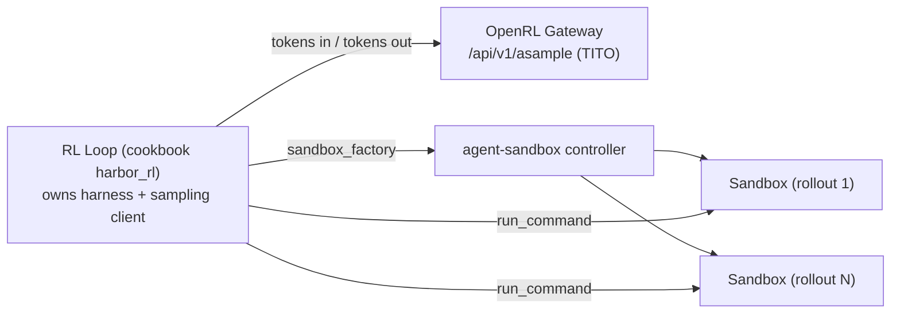
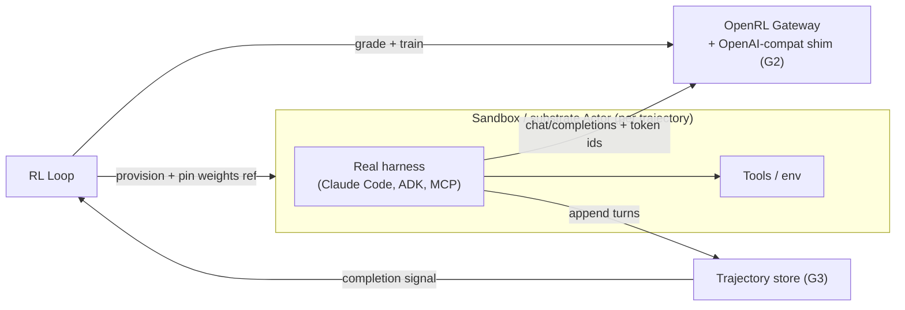

# Design Doc 012: RL Environments, Agent Harnesses, and Sandbox Integration

**Status**: Draft — request for comment
**Author**: Open-RL Engineering
**Date**: 2026-08-20
**Target Branch**: `fft`

---

## 1. Executive Summary

Several people have asked how OpenRL interacts with RL environments, and whether there is an
opportunity to integrate with [agent-sandbox][agent-sandbox] or [agent substrate][substrate]. This
document answers both.

**The short version — the integration is much smaller than expected, and it is a contribution to
tinker-cookbook, not a feature in OpenRL.**

1. **We do not need to design an environment abstraction.** Because OpenRL is Tinker-compatible, we
   inherit tinker-cookbook's `Env` / `EnvGroupBuilder` — and, more importantly, its
   **`SandboxInterface` Protocol**, a six-method pluggable sandbox backend with explicit
   dependency injection (§5.3). Shipped backends are Modal and SandboxFusion. **There is no
   Kubernetes backend.** That is the gap.
2. **The deliverable is `AgentSandboxBackend(SandboxInterface)`** — roughly 200 lines implementing
   `run_command` / `read_file` / `write_file` / `send_heartbeat` / `cleanup` against agent-sandbox,
   plus a `sandbox_factory`. It lands in tinker-cookbook (or an OpenRL example), touches no OpenRL
   server code, and makes every existing cookbook sandbox recipe — Harbor RL, Terminal-Bench,
   SWE-bench, code_rl — run on Kubernetes instead of Modal.
3. **Three of the gaps I expected are already solved upstream.** Rollout failure semantics,
   deadlines, and batch integrity are handled by `FailFast` / `RetryOnFailure` / `MinViableGroup`,
   `RolloutLimits`, and `TerminationRewardPolicy` (§5.4). We should not reinvent them.
4. **The scaling problem is the opposite of what I assumed.** Harbor RL runs `max_turns=200` with
   `sandbox_timeout=3600s` at ~32 concurrent sandboxes per step. This is not high-churn — it is a
   *small number of long-lived, mostly-idle* sandboxes. That is substrate's density case, not
   agent-sandbox's warm-pool case (§6).
5. **We already ship a working P2 recipe.** `examples/harvey_labs` (plus draft PR [#148][pr148]) runs
   real multi-turn agentic RL against podman sandboxes and reports 48.7% → 67.6% on held-out Harvey
   LAB criteria. It is a complete, validated instance of the pattern this document recommends —
   which turns the proposal from "build an integration" into "port an existing one off a single VM"
   (§5.5).

Only the "agent harness inside the sandbox" pattern (P3) needs new OpenRL API surface, and it is a
deliberate second phase. §10 lists the open questions; Q1 is the only load-bearing one.

---

## 2. Scope: What the OpenRL API Covers

Training and inference are essential to *any* RL run. Environments and reward scoring depend
entirely on the problem domain. OpenRL wraps only what is invariant:

| Concern | Owner |
| --- | --- |
| Trainer (fwd/bwd, optim step) | **OpenRL** |
| Sampler / inference | **OpenRL** |
| Weight lifecycle & GPU scheduling | **OpenRL** |
| RL algorithm & loss | Researcher |
| Rollout scaffolding, envs, failure policy | *tinker-cookbook (inherited)* |
| Sandbox backend | *tinker-cookbook Protocol + agent-sandbox / substrate* |
| Reward / grading | Researcher |

This is consistent with the README's "OpenRL is not an RL framework." The important update versus
earlier drafts of this document: the middle two rows are **already built**, by someone else, in a
form we can use unmodified. Our surface area is one Protocol implementation.

---

## 3. Anatomy of an Agentic Rollout

<!-- TODO: duplicates what docs/rl_concepts.md should own (currently an empty stub). Move it there. -->

Each trajectory consists of an initial prompt; **N turns**, each a tool-call request (from the LLM)
and a tool-call result (from executing it in the environment); a final answer; and one or more
rewards. The multi-turn loop is the *agentic loop*; whatever drives it is the *agent harness*.

```mermaid
sequenceDiagram
    participant Loop as RL Loop
    participant Harness as Agent Harness
    participant Sampler as OpenRL Sampler
    participant Env as RL Environment
    participant Grader as Reward Grader

    Loop->>Harness: rollout(prompt, weights_ref)
    loop N turns
        Harness->>Sampler: sample(tokens) -> tokens + logprobs
        Sampler-->>Harness: tool-call request
        Harness->>Env: execute tool call
        Env-->>Harness: tool output
    end
    Harness-->>Loop: trajectory (tokens, logprobs, turns)
    Loop->>Grader: score(trajectory)
    Grader-->>Loop: reward(s)
    Loop->>Loop: advantages -> forward_backward -> optim_step
```

The design question is **who owns the harness**, because that determines who holds the sampling
client, where the trajectory lives, and how weight versioning works.

---

## 4. Integration Patterns

### P1 — Inline environment (no sandbox)

Tool call is a Python function in the loop's process. This is `examples/text-to-sql` today. Fine for
verifiable, pure, trusted domains.

### P2 — Harness outside, tool execution sandboxed

The loop owns the harness and sampling client; each tool call is dispatched *into* a sandbox.

**This is what the cookbook models, what Harbor RL does, and what works against OpenRL today with
no API changes.** It is the mainstream pattern, not a stepping stone — Terminal-Bench and SWE-bench
RL both live here.

### P3 — Harness inside the sandbox

The loop provisions a sandbox per trajectory containing a real agent (Claude Code, ADK, an
MCP-speaking harness) pointed at a sampling endpoint. The agent rolls out independently, writes its
trajectory to a store, and signals completion.

Needed when the fine-tuned model must generalize across *harnesses* — you train against the real
harness rather than a reimplementation. Not supported today (§7), and outside the cookbook's model,
which assumes the loop calls `step()`.

### P4 — Environment-as-a-service

Long-lived shared env service, no per-trajectory sandbox. The cookbook's `verifiers_rl` recipe
already connects Prime Intellect's Environments Hub this way. Out of scope here.

### Comparison

| | P1 inline | P2 sandboxed tools | P3 sandboxed harness | P4 env service |
| --- | --- | --- | --- | --- |
| Owns sampling client | RL loop | RL loop | Agent in sandbox | RL loop |
| Owns trajectory | RL loop | RL loop | Shared store | Env service |
| Token fidelity (TITO) | ✅ native | ✅ native | ❌ blocked (§7.2) | ⚠️ depends |
| Isolation | ❌ none | ✅ per-trajectory | ✅ per-trajectory | ⚠️ shared |
| Weight pinning | ✅ | ✅ | ⚠️ LoRA only (§7.4) | ⚠️ |
| Harness generalization | ❌ | ❌ | ✅ | ⚠️ |
| Covered by cookbook | ✅ | ✅ `SandboxInterface` | ❌ | ✅ `verifiers_rl` |
| Concurrency profile | n/a | few, long-lived, idle | many, long-lived, idle | n/a |
| **Works on OpenRL today** | **✅** | **✅** | **❌** | **✅** |

**Recommendation: ship P2 first.** It is a Protocol implementation, not a design. Treat P3 as the
follow-on that justifies the §7 work.

---

## 5. What Already Exists

### 5.1 OpenRL's sampling surface is tokens-in / tokens-out, end to end

`POST /api/v1/asample` (`gateway.py:662`) accepts `prompt.chunks[].tokens`, flattens to
`prompt_token_ids`, and enqueues. The sampler passes those straight to vLLM with `logprobs=1` — the
comment reads *"return logprobs for TITO RL"* — returning `{tokens, logprobs, stop_reason}`.

**No detokenize/retokenize step exists on the hot path.** OpenRL is structurally immune to
re-tokenization mismatch today, and sampler logprobs give the loop what it needs for
importance-sampling correction against the *other* mismatch source (numerical divergence between
sampler and trainer). §7.2 is about not losing this.

### 5.2 Weight versioning differs by fine-tuning mode

`save_weights_for_sampler` (`gateway.py:532`) mints a per-snapshot sampling session id:

- **LoRA** — requests queued by `base_model`, served by a *shared* sampler attaching adapters via
  `LoRARequest` (design 009 §2.2). Versions coexist. **A rollout can pin a weight version.**
- **FFT** — dedicated sampler per `model_id`, single `CURRENT_LOADED_SAMPLER_WEIGHTS`, swapped in
  place under `reload_lock` (`vllm_sampler.py:221-252`). **Two versions cannot be live at once.**

Invisible today; load-bearing the moment rollouts outlive a training step. With Harbor's
`sandbox_timeout=3600s`, they will. See §7.4.

### 5.3 The integration seam already exists: `SandboxInterface`

`tinker_cookbook/sandbox/sandbox_interface.py` defines a `@runtime_checkable` Protocol:

```python
class SandboxInterface(Protocol):
    @property
    def sandbox_id(self) -> str: ...
    async def send_heartbeat(self, timeout: int = 30) -> None: ...
    async def run_command(self, command: str, workdir: str | None = None,
                          timeout: int = 60, max_output_bytes: int | None = None) -> SandboxResult: ...
    async def read_file(self, path: str, max_bytes: int | None = None, timeout: int = 60) -> SandboxResult: ...
    async def write_file(self, path: str, content: str | bytes,
                         executable: bool = False, timeout: int = 60) -> SandboxResult: ...
    async def cleanup(self) -> None: ...
```

Backends ship as `modal_sandbox.py` and `sandboxfusion.py`. Injection is explicit:

```python
SandboxFactory = Callable[[Path, int], Awaitable[SandboxInterface]]
# cli_main(sandbox_factory=...) -> HarborDatasetBuilder -> HarborEnvGroupBuilder.make_envs()
```

The `harbor_rl` README has a section titled *"Sandbox Protocol and custom backends"*. This is a
supported extension point, not a seam we are prying open.

**There is no Kubernetes backend. That is the entire opportunity.**

#### Harbor, for context

Harbor is a *task format* — "standardized format for SWE/Terminal-Bench style tasks", explicitly to
separate task authoring from the training harness:

```
~/.cache/harbor/tasks/<shortuuid>/<task_name>/
  ├── environment/Dockerfile     # the sandbox image
  ├── tests/test.sh              # the reward
  ├── instruction.md
  └── task.toml
```

`HarborTask(task_name, instruction, task_dir, config)`. The recipe gives an agent a bash tool inside
the container, runs up to `max_turns`, and rewards on test results. Datasets available today include
Terminal-Bench 2.0 (89 tasks) and SWE-Bench-Verified 1.0 (500 tasks).

Note the consequence for pooling: **each task ships its own Dockerfile**, so sandbox images are
per-task. A single generic `SandboxWarmPool` cannot pre-warm them (§6).

### 5.4 Failure semantics and limits are solved upstream — do not reinvent

`tinker_cookbook/rl/rollout_strategy.py` provides `FailFast` (default — any trajectory error crashes
the group), `RetryOnFailure`, and `MinViableGroup`. `rollout_limits.py` provides `RolloutLimits`
(`max_turns`, `rollout_timeout_seconds`, `sampling_turn_timeout_seconds`), `ParseErrorPolicy`, and
`TerminationRewardPolicy` (`zero_reward_on_limit`, `skip_grading_on_timeout`,
`grader_timeout_seconds`).

Design details worth borrowing rather than rediscovering:

- `StopReason` is an enum — `COMPLETED`, `TOOL_STOPPED`, `MAX_TURNS`, `MAX_TOKENS`,
  `MAX_SAMPLED_TOKENS`, `MAX_TOOL_CALLS`, `CONTEXT_OVERFLOW`, `PARSE_ERROR`, `ROLLOUT_TIMEOUT` —
  encoded one-hot on the final transition as `metrics["stop/<reason>"]`.
- A `rollout_timeout` ends the episode *gracefully*: the trajectory is kept and remains gradeable,
  unlike a strategy-level timeout.
- `InitialObservationOverflow` handles an over-budget prompt by emitting a synthetic zero-token
  transition whose reward still counts toward group centering — so an oversized member does not sink
  the group under `FailFast`.
- `RolloutError` is a frozen dataclass returned by value, so failures survive pickling to
  distributed rollout workers. `EnvGroupBuilder` implementations must be pickleable.

My earlier draft listed "failure semantics and batch integrity" as an open gap. It is not. It is
solved, and better than what we would have specified.

### 5.5 Case study: `examples/harvey_labs` is P2, in production, today

The Harvey LAB recipe (`upstream/main`, plus draft PR [#148][pr148] targeting `fft`) is a complete
working P2 implementation with published results — held-out criterion pass rate 48.7% → **67.6%**
(Qwen3.5-9B LoRA, 20 steps, 8×6 rollouts). It is the best evidence we have for everything above.

**How it maps to the cookbook seams:**

| Cookbook seam | Harvey LAB implementation (`examples/harvey_labs/`) |
| --- | --- |
| `EnvGroupBuilder.make_envs()` | `LabEnvGroupBuilder.make_envs()` starts `group_size` podman containers concurrently via `asyncio.gather(asyncio.to_thread(start_sandbox))` — one sandbox per rollout |
| `Tool` protocol | `LabTool` wraps LAB's `ToolExecutor`; `run()` offloads the blocking podman shell to a thread so one slow tool call cannot stall the group |
| Harness | `build_agent_tool_env(...)` from `tinker_cookbook.tool_use` — **runs in the loop, outside the sandbox** |
| `reward_fn` | `LabRubricReward` — LLM-as-judge over the task rubric, executed as a host subprocess in the LAB venv |
| `EnvGroupBuilder.cleanup()` | stops every container in the group |

Harness outside, tool execution inside: **P2, unambiguously.**

Two details worth borrowing. `CountedCriteriaEnv` is a decorator that guarantees `lab/criteria_*`
metrics are emitted even when an episode dies before grading — a hand-rolled solution to the same
accounting problem the cookbook solves with `InitialObservationOverflow` (§5.4), and a candidate for
replacement by the upstream mechanism. `bounded_tool_result` truncates oversized tool output on a
token budget with a line-aligned cut and a resume hint (`offset=N`), which is a genuinely good idea
that Harbor's 60% context-overflow ERROR rate suggests upstream lacks.

**It uses a third sandbox abstraction.** LAB's `sandbox.sandbox.Sandbox(documents_dir, output_dir,
workspace_dir, image, default_timeout)` is **volume-mount oriented** — three host directories bound
into the container. The cookbook's `SandboxInterface` (§5.3) is **command-and-file-RPC oriented**.
These are not trivially interchangeable. The repo now touches three sandbox models: LAB's podman
`Sandbox`, the cookbook's `SandboxInterface`, and agent-sandbox's `Sandbox` CRD.

**Its concurrency profile independently reproduces Harbor's.** `batch_size=8` ×
`rollouts_per_example=6` = **48 concurrent containers**, `max_trajectory_tokens=131072`,
`max_tokens=16384`, all on a single 8-GPU VM. Two unrelated recipes converge on *a few dozen
long-lived, mostly-idle sandboxes* — which is the §6 claim, arrived at twice.

**The porting obstacle is host-filesystem coupling, and it is also the scaling wall.** The sandbox
writes to host directories under `<lab_root>/results/<run_id>/`; the grader is a host subprocess
that reads those files back. Containers therefore have to be co-resident with the trainer, which
pins the whole recipe to one VM and makes 48 containers compete with training for that node's CPU,
RAM, and disk. Moving execution to a remote pod breaks the shared filesystem — so decoupling
grading from the host FS is simultaneously the port and the reason to do it.

Smaller issue in the same area: `GRADING_CONCURRENCY = threading.Semaphore(6)` (`reward.py`) is
process-local, so it will not bound judge QPS once rollouts are distributed across workers.

### 5.6 Capability advertisement

`GET /api/v1/get_server_capabilities` (`gateway.py:340`) exists and is the natural place to advertise
whether a deployment offers an OpenAI-compatible endpoint and with what token-fidelity guarantees.

---

## 6. agent-sandbox and agent substrate Solve Different Problems

The original question — "agent-sandbox *or* substrate?" — presumes they are alternatives. They are
not.

| | [agent-sandbox][agent-sandbox] | [agent substrate][substrate] |
| --- | --- | --- |
| Primitive | `Sandbox` CRD (`agents.x-k8s.io`) — one stateful pod, stable identity, persistent storage | `Actor` / `WorkerPool` / `ActorTemplate` — many actors on fewer worker pods |
| Optimizes for | Isolation and lifecycle | **Density** — ~30x oversubscription, sub-second suspend/resume |
| Latency story | `SandboxWarmPool` + `SandboxClaim` | Snapshot-based hibernation; idle actors cost near-nothing |
| Isolation backend | gVisor / Kata via `RuntimeClass` | gVisor (`runsc`) or cloud-hypervisor microVMs |
| Harness stance | Runtime for untrusted LLM-generated code | Harness-agnostic; names ADK, LangChain, Claude Code, MCP |
| RL posture | Names RL/eval as a target use case | Mentions RL once; **no RL-specific APIs** |

**Which one, and why — corrected from earlier drafts.** I previously assumed RL rollouts meant
thousands of short-lived sandboxes per step, making warm-pool claim latency the critical number.
Harbor's actual configuration says otherwise:

```
max_turns=200,  max_tokens=8192,  sandbox_timeout=3600s
group_size=4,  groups_per_batch=8   ->  ~32 concurrent sandboxes
```

That is a *small* number of sandboxes living up to an hour each, spending nearly all of that time
blocked on 8192-token generations. Claim latency is irrelevant when the episode is 200 turns long.
Two consequences:

- **Warm pooling matters less than I claimed**, and Harbor's per-task Dockerfiles mean a generic
  warm pool cannot pre-warm the right image anyway. `SandboxTemplate`-per-task is possible but the
  economics need checking.
- **Density matters more.** Long-lived, mostly-idle, stateful workloads with a working set far
  larger than the active set is exactly substrate's founding observation. Scaling `groups_per_batch`
  to get real batch sizes makes this the binding constraint.

So: **agent-sandbox is the right first backend** (simpler, stable identity, direct Pod semantics,
Python SDK, matches `SandboxInterface` almost method-for-method). **Substrate is the scaling
answer**, and more so for P3 than P2. Neither has RL-specific APIs, and neither should.

**OPEN:** substrate's control plane is gRPC/Go while the RL loop is Python. Is there a Python client
path? See Q5.

---

## 7. Gaps

### 7.1 Multi-turn masking — verified correct, documentation only

Worth recording because it looks like a bug and is not.

The cookbook's RL path builds a per-token action mask, zeroing observation and tool-output positions
(`rl/data_processing.py:159`), and OpenRL's trainer reads `loss_fn_inputs["weights"]` — a different
key — defaulting to all-ones when absent (`trainer_worker.py:174`). `"mask"` appears nowhere in
`src/`.

That is correct behavior. `rl/train.py` strips the key at **every** `forward_backward` call site
(lines 339, 347, 1562, 1668):

```python
def _remove_mask(datum: tinker.Datum) -> tinker.Datum:
    return tinker.Datum(model_input=datum.model_input,
                        loss_fn_inputs={k: v for k, v in datum.loss_fn_inputs.items() if k != "mask"})
```

So the mask never reaches any Tinker-compatible server. Masking on the RL path is carried entirely
by **zeroed advantages** — `importance_sampling_loss` is `-(ratio * advantages) * weights`
(`losses.py:8`), and observation tokens have `advantage = 0`. OpenRL matches Tinker here, and
`harvey_labs` — which uses `rl_train` and therefore this exact path — is training correctly today.

The only residual exposure is a hypothetical: OpenRL also accepts `loss_fn="cross_entropy"`, which
is `-target_logprobs * weights` with no advantage term, so an RL-assembled datum trained with it
would receive gradient on every tool-output token. No cookbook path does this. **Action: one line in
`docs/tinker-client-compatibility.md` noting that `weights` is the supported per-token channel and
`mask` is client-stripped.** Nothing else.

### 7.2 G1 — OpenAI-compatible sampling without losing token fidelity *(blocks P3 only)*

An agent inside a sandbox cannot use the Tinker SDK's token-level `sample()`; it speaks
`/v1/chat/completions`. No such endpoint exists on `main` or `fft`.

A naive shim reintroduces re-tokenization and forfeits §5.1. The mitigation is a *lossless* shim:
return sampled `token_ids` and per-token `logprobs` alongside the text as extension fields, and
accept `prompt_token_ids` on input so a harness that has them bypasses the tokenizer.

**This is the single blocker for P3.** It does not affect P2 at all.

### 7.3 G2 — Trajectory store and completion signaling *(P3 only)*

In P3 the agent writes its trajectory somewhere and signals the loop; neither agent-sandbox nor
substrate supplies a contract for this. Minimum record: token ids, sampler logprobs, turn
boundaries, per-token action mask, per-turn weights ref, and a terminal `StopReason`.

Design constraint: it should reconstruct into something `assemble_training_data` accepts, so P3 and
P2 trajectories reach `forward_backward` by the same path. Reuse the cookbook's `Trajectory` /
`Transition` / `StopReason` types as the schema rather than inventing one. Redis is already a hard
dependency and is the obvious backing store.

### 7.4 G3 — Weight pinning under FFT

Per §5.2, FFT samplers cannot serve two weight versions concurrently — and Harbor episodes can run
an hour. Options, increasing in cost:

- **Drain at step boundary** — block the reload until in-flight rollouts finish. Couples training
  cadence to the slowest trajectory; bad at `max_turns=200`.
- **Bounded staleness** — continue on old weights for K steps, correct via importance sampling using
  the logprobs we already return. Standard async-RL practice.
- **Version-aware routing** — keep N recent versions resident across replicas, route by pinned ref.
  Most capable, most VRAM.

Whichever we pick, the trajectory must carry the weights ref *per turn* (G2), or the loss is computed
against a policy that did not generate the tokens. Note this bites P2 as well once episodes outlast a
step — it is not P3-specific.

### 7.5 G4 — Security inversion *(P3 only)*

The sandbox exists to contain untrusted LLM-generated code, and P3 hands that code a credential to a
GPU-backed sampling endpoint. Per-trajectory credential scoping and token quotas are required, not
optional. In P2 the sandbox never holds a sampling credential — another reason to lead with it.

---

## 8. Proposed Integrations

### 8.1 Design A — P2, an agent-sandbox `SandboxInterface` backend

Implement the Protocol against agent-sandbox and inject it. No OpenRL server changes.

```python
class AgentSandboxBackend:                      # satisfies SandboxInterface structurally
    @property
    def sandbox_id(self) -> str: return self._claim.name
    async def run_command(self, command, workdir=None, timeout=60, max_output_bytes=None): ...
    async def read_file(self, path, max_bytes=None, timeout=60): ...
    async def write_file(self, path, content, executable=False, timeout=60): ...
    async def send_heartbeat(self, timeout=30): ...      # -> Sandbox lifecycle / keepalive
    async def cleanup(self): ...                         # -> release or delete the Sandbox

async def agent_sandbox_factory(env_dir: Path, timeout: int) -> SandboxInterface:
    image = build_image(env_dir / "Dockerfile")          # per-task image, see §5.3
    return await AgentSandboxBackend.create(image=image, timeout=timeout)

cli_main(sandbox_factory=agent_sandbox_factory)          # that is the whole integration
```



Token fidelity is native; weight pinning works in both modes because the loop controls sampling
cadence; the sandbox holds no sampling credential; OpenRL takes on no new API surface. Every
existing cookbook sandbox recipe inherits it.

**Where it lands:** upstream in tinker-cookbook alongside `modal_sandbox.py` and `sandboxfusion.py`
is the higher-leverage placement — it benefits Tinker users, not just OpenRL users, and the Protocol
is explicitly designed for it. See Q2.

### 8.2 Design B — P3, sandbox-hosted harness (needs G1–G2)

The loop provisions a sandbox or substrate actor per trajectory containing a real harness, configured
with an OpenAI-compatible base URL, a pinned weights ref, and a trajectory sink.



Sequencing: G1 first (blocker, independently useful), then G2, then G3 per whichever staleness policy
Q4 selects. Substrate is the more natural host than raw agent-sandbox, per §6.

---

## 9. Non-Goals

- OpenRL will not define an `Env` abstraction, sandbox protocol, tool-calling protocol, failure
  policy, or reward interface. The cookbook has all of them (§5.3, §5.4).
- OpenRL will not take a build- or runtime dependency on the agent-sandbox or substrate CRDs.
  Backends and examples may; the server must not.
- P4 (environment-as-a-service) is out of scope; `verifiers_rl` already covers it.

---

## 10. Open Questions

- **Q1 (blocks P3 only).** Do we take on an OpenAI-compatible sampling endpoint — thin gateway shim,
  or vLLM's OpenAI server behind our worker selection? And do we commit to the token-id + logprob
  extension fields that preserve TITO?
- **Q2.** Does `AgentSandboxBackend` land upstream in tinker-cookbook, or in `open-rl/examples/`?
  Upstream has more leverage and matches the Protocol's intent; it also means an external review
  cycle.
- **Q3.** Per-task Dockerfiles (§5.3) versus `SandboxWarmPool`. Do we do `SandboxTemplate`-per-task,
  accept cold builds, or maintain a prebuilt image cache keyed by task hash?
- **Q4.** Is bounded-staleness sampling an acceptable default for long episodes, or must it be
  opt-in?
- **Q5.** Substrate is gRPC/Go; the RL loop is Python. Is there a Python client path, or is that a
  gap we would need to close before P3-on-substrate?
- **Q6.** Which recipe carries the demo — `harvey_labs` (ours, proven, but volume-mount coupled) or
  `harbor_rl` (upstream, already `SandboxInterface`-shaped)? See §12.

---

## 12. Adapting `harvey_labs` to Showcase the Patterns

`harvey_labs` is the strongest demo vehicle we have: a real benchmark, a published training curve,
and a scaling wall that our infrastructure is the answer to. Three increments, each shippable alone.

### Step 1 — P2 on Kubernetes (swap the backend, keep the recipe)

Replace LAB's podman `Sandbox` with an agent-sandbox-backed implementation behind the same
constructor. `make_envs()`, `LabTool`, the reward, and the training config are untouched; the
demonstration is that **the same recipe reproduces the same curve while the 48 containers move off
the trainer node.** That is the whole pitch for P2-on-Kubernetes, measured against a baseline we
already have.

The work is not the API — it is breaking the host-filesystem coupling in §5.5:

- `documents_dir` / `workspace_dir` → stage into the Sandbox at claim time (write_file, PVC, or an
  init container) instead of bind-mounting host paths.
- `output_dir` → the grader currently reads `<lab_root>/results/<run_id>/output` from the host. Pull
  artifacts back over the sandbox API before grading, or run the judge shim where the files are.
- `GRADING_CONCURRENCY` → move the process-local semaphore to something distributed once rollout
  workers are spread across pods.

Success criterion: held-out pass rate within noise of run 9's 67.6%, with sandboxes on separate
nodes from the trainer.

### Step 2 — Generalize through `SandboxInterface` (optional, higher leverage)

Rather than an agent-sandbox backend for LAB specifically, implement the cookbook's
`SandboxInterface` (§5.3) and adapt LAB onto it. Then `harbor_rl`, `code_rl`, Terminal-Bench and
SWE-bench all gain a Kubernetes backend from the same work, and it is contributable upstream.

The friction is real and should be scoped before committing: `SandboxInterface` is
command-and-file-RPC oriented while LAB's `Sandbox` is volume-mount oriented, so LAB needs an
adapter either way. Note this is the same adapter Step 1 requires — Step 2 is mostly a decision
about *where the seam lives*, not extra work. This is Q2 and Q6.

### Step 3 — P3, move the LAB harness inside the sandbox

`harvey_labs` is the best P3 candidate in the repo, because Harvey LAB **ships its own harness**
(`harness.tools`, `ToolExecutor`) and the deployment target for a LAB-tuned model is that harness,
not `build_agent_tool_env`. Today we train against a cookbook reimplementation of the agent loop and
hope it transfers; P3 removes that gap by construction. That is the clearest concrete motivation for
G1–G4 we have, and it is a legal-domain story rather than a coding-agent story.

Gated on G1 (§7.2) and G2 (§7.3). Do not start it before Step 1 lands.

---

## 13. Proposed Next Steps

1. Resolve Q2/Q6, then execute **Step 1** — `harvey_labs` on agent-sandbox, on GKE, reproducing run
   9's curve with sandboxes off the trainer node. This is the single highest-value deliverable in
   this document and it validates the whole P2 story against a real baseline.
2. Measure the §6 concurrency profile while doing it — how many concurrent long-lived sandboxes we
   hold before density, not claim latency, becomes binding. That number decides whether substrate
   enters the picture for P2 or only for P3.
3. Land PR [#148][pr148] or extract the harvey_labs parts of it, so the demo has a stable base.
4. Add the §7.1 line to `docs/tinker-client-compatibility.md`. Two minutes, prevents a future
   misdiagnosis.
5. Resolve Q1 to unblock P3 (Step 3).
6. Fill in `docs/rl_concepts.md` and move §3 there.

[agent-sandbox]: https://github.com/kubernetes-sigs/agent-sandbox
[substrate]: https://github.com/agent-substrate/substrate
[cookbook]: https://github.com/thinking-machines-lab/tinker-cookbook
[pr148]: https://github.com/gke-labs/open-rl/pull/148
