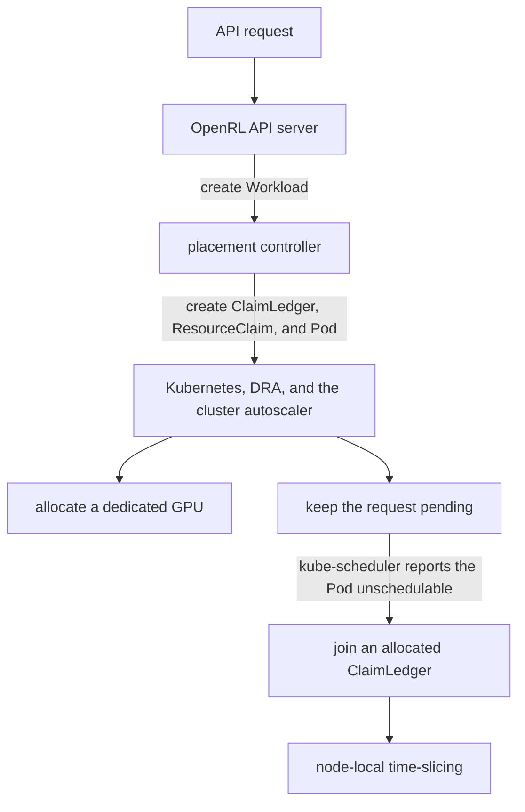
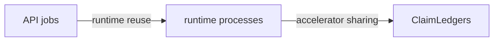
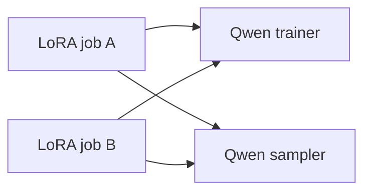
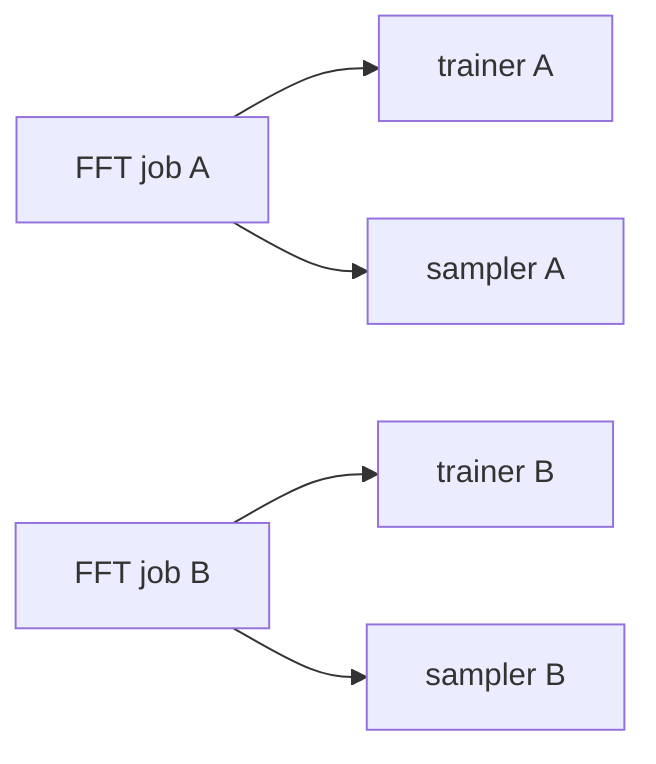
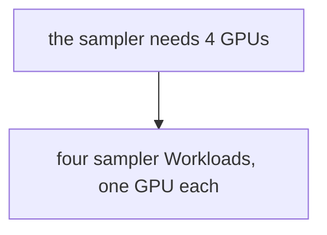
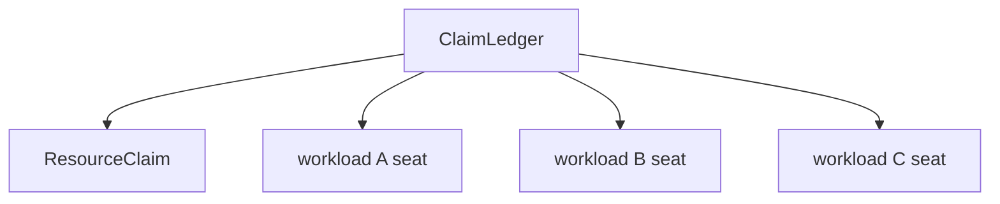
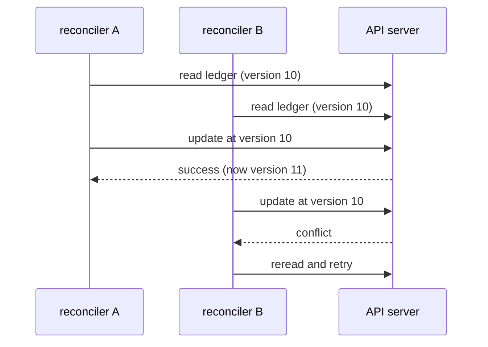
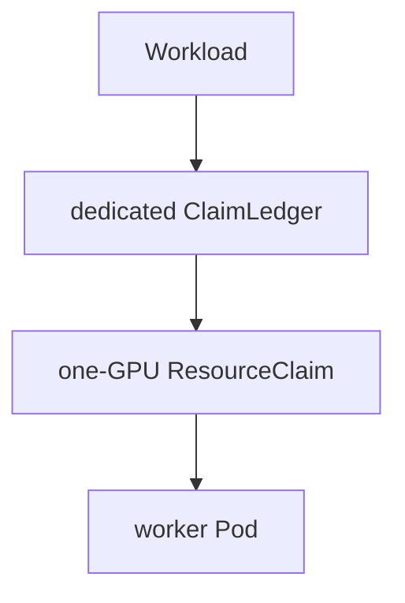
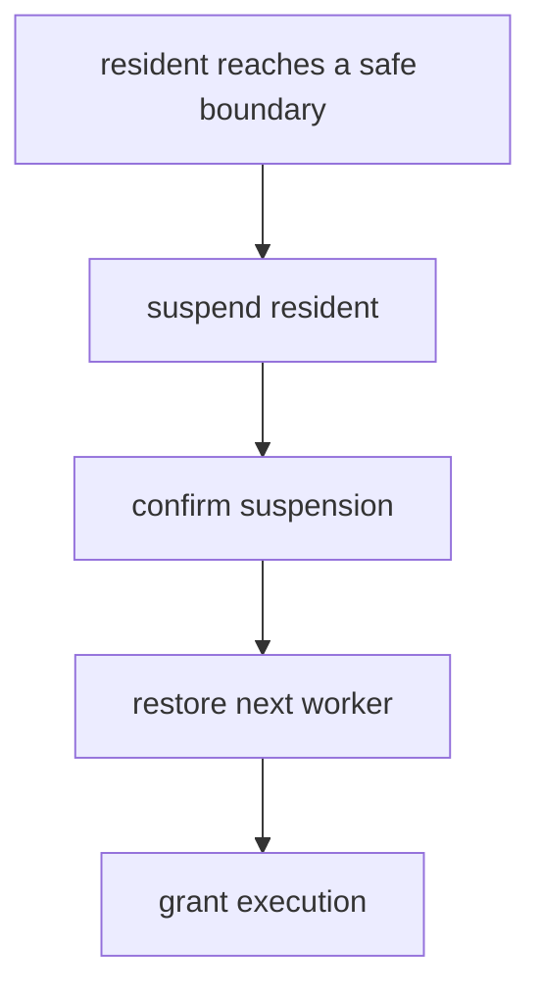

# Dynamic Accelerator Placement and Time-Slicing for OpenRL

**Status:** Draft
**Author:** Shuby Mishra
**Reviewers:** —
**Last updated:** August 27, 2026

## Overview

OpenRL is a self-hosted post-training platform that runs trainer and sampler
workers on accelerator hardware in Kubernetes. Today, its Kubernetes path
relies on pre-created Dynamic Resource Allocation (DRA) `ResourceClaim`
objects that workers share through OpenRL's time-slicing lifecycle. This
works for a fixed deployment, but the available accelerator capacity and its
mapping to workers must be configured ahead of time. As OpenRL supports more
hardware configurations and concurrent workloads, placement should instead
adapt to each workload and the capacity available in the cluster.

OpenRL's original multi-tenant path is built around LoRA. A worker loads one
shared base model and serves multiple clients by switching between
lightweight adapters. Full fine-tuning changes this model: each job can
modify the full set of weights, so each FFT job runs in its own process and,
on Kubernetes, its own worker Pod. OpenRL must therefore decide how these
processes share and consume accelerator capacity.

This design makes placement dynamic by adding a **placement controller**: a
Kubernetes controller that acts as an accelerator scheduler. The API server
records each request as a `Workload`, which describes one worker: one
runtime process in one Pod. The controller decides where that worker runs
by creating a `ClaimLedger`, a `ResourceClaim`, and the worker Pod, and it
reads the outcome back from DRA and kube-scheduler. DRA owns the inventory
of free devices; the controller keeps none.



Sharing is allowed only between workers whose `spec.exclusive` is false.
The API server sets it from the training kind: false for FFT workers, which
suspend between turns, true for LoRA workers, which stay resident. An
omitted field is exclusive. Each ledger seat records the flag; selection
checks every occupant and booking repeats that check inside the ledger CAS
loop.

A new worker can be placed by exactly two moves: cut a dedicated claim of
its own, or book a seat on an existing allocated `ClaimLedger` and share. A
flag specifies the strategy. Under `spread`, the worker asks
for a GPU of its own first and shares only when the cluster says no. Under
`binpack`, the order flips: the worker sits on an existing ledger when one
can hold it, and asks for its own GPU only when none can. Whichever order,
when both moves are exhausted the end state is the same: a standing pending
claim, described below.

Bin-packing first is also what makes autoscaling behave well. Under spread,
a busy fleet cuts a claim for every arrival and retracts it moments later
when the worker falls back to sharing, so the autoscaler sees demand that
vanishes before it can act on it. Under binpack a claim exists only when no
ledger can seat the worker, which makes every pending claim a true request
for more capacity, and it stays standing until either a new node arrives or
a seat frees up.

To ask for a GPU, the controller cuts a dedicated `ResourceClaim` and
creates the worker Pod that consumes it. Because DRA allocates the claim
only while kube-scheduler schedules the Pod, the Pod itself serves as the
capacity probe. If a device is free the worker runs alone on it, and if
none is, kube-scheduler marks the Pod `Unschedulable`, which is the verdict
that triggers the fallback. The worker then books a seat on an allocated
ClaimLedger, the controller deletes the abandoned dedicated claim, and the
Pod is rebuilt against the shared claim. If no ledger has the host memory to
seat the worker either, the pending claim and its unschedulable Pod simply
stay standing, ready to schedule the moment capacity frees without any
action from the controller, and on autoscaled fleets that standing claim
doubles as the scale-up signal.

A ClaimLedger is a namespaced custom resource holding the workers assigned
to one `ResourceClaim`. Every claim is born with one: a dedicated claim
starts with a one-seat ledger that later workers may join, and a join adds
a seat to an existing ledger rather than creating anything. Each booking on
it is a *seat*. A ledger with several seats is time-sliced: suspended
workers park their state in host memory, a node-local daemon rotates which
one is resident, and one worker uses the GPU at a time. A seated worker
stays where it is when capacity frees; the freed device serves new work.

This placement applies to every worker Pod. The LoRA path keeps its
in-process sharing: jobs may reuse a runtime process before placement, as
section 1 describes. Each FFT job runs its own process.

How to read this document: sections 1-3 are the contract with the API server
and can be read alone. Sections 4-6 are the placement mechanism. Sections 7-9
are runtime behavior, failure handling, and scenarios.

## Objects and ownership

State is split across four objects, and each object has one writer. The API
server writes what is wanted. The placement controller writes what was
decided. Kubernetes writes what is true. All namespaced OpenRL objects live
in `openrl-system`. Owner below means who decides the object's spec. Status
is written by whoever observes the fact: the controller writes
`Workload.status`; kube-scheduler writes the claim's allocation.

| Object          | Purpose                                          | Owner                |
| --------------- | ------------------------------------------------ | -------------------- |
| `Workload`      | Desired state for one trainer or sampler runtime | API server           |
| `ClaimLedger`   | Seats assigned to one accelerator allocation     | Placement controller |
| `ResourceClaim` | DRA request and device allocation                | Placement controller (1:1 with its ClaimLedger) |
| Worker Pod      | Runtime process consuming the claim              | Placement controller (GC parent: its Workload) |

Owner here means the entity that decides the object's content and lifecycle,
not a Kubernetes `ownerReference`. Two garbage-collection references exist:
the worker Pod carries a controller reference to its Workload, and each
claim carries an ownerReference to its ClaimLedger. ClaimLedgers are shared
between workloads, so no single workload can own them for garbage
collection. Deletion order matters — ledger first, then claim, each step
conditional — and the controller still performs both deletions itself
(section 8); the claim's ownerReference is a backstop, not a second
deleter: if the controller crashes between the two deletes, garbage
collection finishes the claim's half instead of orphaning an allocated
device.

The API server and placement controller communicate only through Kubernetes
objects. The API server does not query accelerator inventory, choose claims, or
create worker Pods directly.

Two different things in this system are called sharing. Jobs may share a
runtime process; the API server decides that before placement exists
(section 1). Separate runtime processes may later share an accelerator by
taking turns; that is a placement outcome (sections 4-7). The two are
independent by design:



LoRA jobs may reuse runtime processes before placement. FFT jobs do not.
Distinct runtime processes may later share a ClaimLedger under contention.

## Reconciliation triggers

Reconciliation is level-triggered: a reconcile reads current state and acts
on it, so it does not matter which event delivered it or how late. The watch
wiring decides only *when* a Workload is re-examined:

| Change                                            | Trigger path                       | Who reconciles          |
| ------------------------------------------------- | ---------------------------------- | ----------------------- |
| Workload created, updated, or deleted             | primary watch                      | that Workload           |
| Worker Pod changes or disappears                  | Pod's controller reference         | its owning Workload     |
| A managed `ResourceClaim` changes (managed = carries the controller's `openrl.io/managed` label, stamped at creation) | claim watch, fleet-wide fan-out | every Workload |
| Node capacity changes (labels, allocatable)       | node watch, filtered               | every Workload          |
| `ClaimLedger` changes                              | not watched                        | nobody (see below)      |
| Nothing happens                                   | periodic requeue                   | each Workload, steadily |

The two questions this wiring answers:

*A claim flips to allocated.* Claim events fan out to every Workload, not one,
because capacity is fleet-wide: the device that just allocated (or freed) may
unblock any pending worker, and once claims are shared there is no 1:1 claim
-> workload mapping to exploit. The claim's own workload observes the
allocation and records the winning tier in status (its Pod already exists;
the Pod's scheduling is what caused the allocation). A pending worker
observes new fleet state and retries placement. Fan-out is bounded by the
workload count, and reconciles are cheap reads of the informer cache.

*A worker Pod crashes or is deleted.* The Pod carries a controller reference
to its Workload, so its deletion enqueues exactly that Workload. The
reconcile finds the assignment recorded in status and the seat still booked
(seats outlive Pods by design), and recreates the Pod against the same claim.
Nothing about the booking is re-decided.

ClaimLedgers are deliberately not watched. Seats are written only by this
controller, by many concurrent reconciles within it, racing on the same
ledger and arbitrated by `resourceVersion` (section 5). So every seat transition
is caused by some reconcile, and that reconcile handles the consequences in
the same pass. No reconcile acts on remembered ledger state; each pass
re-reads the fleet. The claim fan-out and the periodic requeue already
provide the wake-ups. A ledger watch would add events, not information.
One accepted consequence: a freed *seat* (a non-last seat removal) changes
no claim and wakes nobody, so a pending worker observes it on its periodic
requeue, at most one interval late. Freed *devices* (a claim deleted) fan
out immediately.

The periodic requeue is the safety net: any state a watch event failed to
deliver is observed at most one interval late.

## 1. API server and runtime identity

Before placement, the API server decides whether a job needs a new runtime
process or can reuse one. It encodes that decision in deterministic workload
names, so concurrent and duplicate requests converge on the same object
through `AlreadyExists`. The two training modes differ only in whether
identity is shared across jobs. LoRA (low-rank adaptation: many adapters on
one base model) reuses runtimes. FFT (full fine-tuning: each job owns its
weights) never does.

### LoRA

Compatible LoRA jobs reuse one trainer and one sampler runtime:



The API server derives a runtime key from properties that affect reuse,
including:

* base-model and tokenizer revision;
* runtime configuration;
* dtype or quantization;
* context limit;
* adapter format and capacity;
* trainer or sampler role.

Placement is not part of the runtime key: identity must survive the workload
moving between dedicated and shared ledgers, so nothing the placement
controller decides may feed back into the name. A shared LoRA runtime's
`ownerID` is its runtime key (the base-model identity). Jobs attaching and
detaching do not change the seat's fairness identity.

The API server chooses a runtime instance and creates deterministic workload
names:

```text
lora-qwen-0-trainer
lora-qwen-0-sampler
```

For concurrent compatible requests, one create succeeds and the other returns
`AlreadyExists`. That means the runtime has already been requested; it does not
mean placement has completed.

When the runtime reaches adapter capacity, the API server creates another
instance:

```text
lora-qwen-1-trainer
lora-qwen-1-sampler
```

Adapter assignment remains in the API-server application state.

### FFT

FFT jobs never reuse trainer or sampler processes:



Each job has independent model weights and optimizer state. Its sampler serves
snapshots of those job-specific weights.

Workload names include the job identity:

```text
fft-<job-id>-trainer
fft-<job-id>-sampler
```

The trainer and sampler are separate workloads but use the same owner ID for
time-slicing fairness.

For FFT, `AlreadyExists` means the same job-specific workload was submitted
twice. It provides idempotency, not cross-job reuse.

## 2. Workload

One `Workload` represents one desired trainer or sampler runtime.

```yaml
apiVersion: openrl.io/v1alpha1
kind: Workload
metadata:
  name: fft-job-123-trainer
  namespace: openrl-system

spec:
  role: trainer
  trainingKind: fft
  exclusive: false
  modelID: job-123
  ownerID: job-123

  accelerator:
    memory: 60Gi

  workerContainerName: worker

  template:
    spec:
      restartPolicy: OnFailure
      containers:
      - name: worker
        image: ghcr.io/gke-labs/open-rl/trainer:latest
        command:
        - uv
        - run
        - python
        - -m
        - server.training_requests_processor
        args:
        - --model-id
        - job-123
        resources:
          requests:
            cpu: "12"
            memory: "100Gi"
```

Every shipped runtime drives exactly one device, which is what the default
`accelerator.mode: SingleGPU` says: one device with room for `memory`, and
no device count to guess. A runtime that can drive a wider claim gets a
new mode carrying its own count field (section 12), an addition rather
than a change. `workerContainerName`
names the container in the template that consumes the accelerator; the
claim reference and the controller's stamps land on that container.

The Pod template is inline. The API server supplies everything known before
placement:

* image, command, and arguments;
* environment variables;
* CPU and host-memory requests;
* volumes and mounts;
* service account;
* security context;
* tolerations;
* sidecars.

The controller adds only placement-derived fields:

* the Pod-level claim reference;
* the worker container's claim-consumption entry;
* node affinity for eligible OpenRL nodes;
* the ClaimLedger and assignment IDs;
* the Pod owner reference.

Placement-owned fields in the supplied template (node selection, DRA claim
references, accelerator resource requests, and OpenRL assignment fields)
are rejected twice: CEL validation rules on the CRD refuse them at admission,
and the controller re-validates before rendering as a backstop.

The workload spec is immutable, enforced by CRD CEL transition rules: the
spec is what the runtime key and the placement decision were derived from, so
a changed runtime is a different workload, not an edit. Changing the runtime
or Pod template means deleting and recreating the workload.

Node eligibility is label-based and set by the operator when opting nodes in:
`openrl.io/enabled` marks a node as OpenRL's, exclusively: the design
assumes no other GPU consumers there, and `openrl.io/trainer` and
`openrl.io/sampler` grant roles. There is no seat-count label: the node's
allocatable host memory is the ceiling on how many workers park there
(section 4).

### Workload assignment

The workload records its one committed assignment:

```yaml
status:
  phase: Running
  claimName: claim-fft-job-123-trainer-a81f4c
  assignmentID: 6f04fe8d-7971-480d-aee5-5ee228c4da3f
  deviceCount: 1
  memoryPerDevice: 60Gi
```

The claim name and assignment ID are the assignment; the ledger's name is
derived from the claim's, so naming the claim names both. This is not a
copy of DRA allocation state: it prevents the same workload from committing
to two ledgers concurrently. `deviceCount` and `memoryPerDevice` record the
winning tier once allocation is observed.

The workload does not copy the claim's node, allocation phase, or device
memory. Those remain authoritative on the `ResourceClaim` and `ResourceSlice`
objects.

## 3. Current execution shape

For now, every workload spans exactly one GPU. The current trainer and
sampler use no data parallelism, FSDP, or tensor parallelism.

The estimator is the API server's sizing component. It maps a base model,
training kind, and role, plus client topology metadata when present, to the
resource figures a workload carries. Today it is a calibrated table, and it
can become per-model estimation later without anything downstream changing,
because its entire output is the numbers in the Workload spec. It reports
peak accelerator memory for the one device:

```yaml
accelerator:
  memory: 60Gi
```

The controller never divides this figure across devices. A 60 GiB trainer
cannot run on several 24 GiB GPUs; it needs one device large enough to hold
it, and OpenRL will not infer a distributed layout by dividing aggregate
memory by device size.

As OpenRL scales to recipes like the Harvey Labs legal fine-tune (the Legal LoRA recipe of
section 9), workloads
outgrow a single device. The first step is data parallelism, which is
essentially running more copies of the same worker, so a role that needs
four GPUs becomes four one-GPU workloads.



A DP replica is exactly the workload this design already places, one seat
on one claim, so scaling a role out is the API server's job. It creates N
workloads with suffixed names, routes requests across them, and pushes
weight updates to each, with no scheduler or placement change. The replicas
land wherever capacity exists, and nothing requires them to share a node.
Tensor parallelism comes after, placing one replica across an explicit
model-compatible device count, and a combined DP and TP mesh comes last,
each stage demanding strictly more from the scheduler than the one before.

To do any of this, the client declares its intent up front in metadata:

```python
create_model(
  ...,
  meta={
    "trainer": {"dp": 1, "tp": 4},
    "sampler": {"dp": 2, "tp": 2},
  },
)
```

Each key names a role, `dp` says how many replicas of it run, and `tp` says
how many devices one replica spans. The estimator resolves each entry into
one shape per workload, a device count and a per-device memory figure, and
the API server fans `dp` out into that many single-shape workloads, so the
width never reaches a Workload spec. This example asks for one trainer
across four devices and two sampler replicas of two devices each. The
example shows the full future contract; today only `dp` is accepted, and
keys beyond it are rejected until the stage that implements them lands.

What DP cannot express, this design does not yet place:

* a model too large for any single device (needs tensor parallelism, a
  multi-device claim);
* a trainer whose optimizer state is sharded across devices in one process
  group (FSDP, also a multi-device claim);
* two roles that must land on the same host atomically (needs one claim with
  several named device requests).

How to fit a shape stays the scheduler's job either way, and it derives the
alternatives itself, device-size tiers today and partitioned, time-sliced,
or split arrangements later.

## 4. ClaimLedger

A ClaimLedger represents one accelerator allocation and its assigned workloads.



Each ClaimLedger owns one one-GPU `ResourceClaim`.

```yaml
apiVersion: openrl.io/v1alpha1
kind: ClaimLedger
metadata:
  name: ledger-fft-job-123-trainer-a81f4c
  namespace: openrl-system

spec:
  seats:
  - workload:
      name: fft-job-123-trainer
      uid: 4f164c5e-7e3f-4dc3-a6ec-6997db852f52
    ownerID: job-123
    assignmentId: 6f04fe8d-7971-480d-aee5-5ee228c4da3f
    hostRequest: 100Gi
```

`spec.seats` is the authoritative OpenRL membership record. Each seat contains:

* workload name and UID;
* owner ID;
* assignment ID;
* Pod host-memory request (the Pod's effective memory request: the sum
  over its containers).

The workload UID prevents a recreated workload from inheriting the old
workload's seat.

The ClaimLedger does not mirror allocation status. Allocation, node, and device
memory are read from its owned `ResourceClaim` and the DRA inventory.

### Seat limit

There is no per-claim seat count. Host memory is the limit on parked
workers: every seat costs host memory even while its worker is off the GPU
-- a suspended worker parks its state in node RAM -- so admission sums the
seats' pod requests against the node's allocatable memory (section 6), and
kube-scheduler enforces those same requests for real when the pod binds.
The two checks split the roles a seat count used to conflate: the advisory
sum steers workers away from full nodes, and the bind is the hard cap. A
join that slips past the advisory check on a stale snapshot produces an
unschedulable pod, which the wedged-claim path unwinds.

An unallocated ledger contains only its dedicated workload and is not
joinable: its node is unknown, so nothing about it can be checked against
anything real.

The accelerator side needs no sum, because each workload must fit the
device by itself; only one worker is resident at a time. The ledger is per
claim because the claim is the unit being time-sliced: a node with four
GPUs has four queues, all drawing on one pool of host memory.

## 5. Assignment and concurrency

Workloads may reconcile concurrently. Correctness does not depend on a global
reconcile lock or leader election.

### ClaimLedger update

To join a ledger, a reconciler:

1. reads the ledger;
2. validates the allocation and admission rules;
3. appends a seat with a new assignment ID;
4. updates the ledger using its current `resourceVersion`.

If another writer changes the ledger first, the stale update receives a conflict
and retries.

A join only ever appends to a ledger that exists. Only a workload's own
reconcile creates its ledger, before its claim exists, so a joiner finding no
ledger has found a retiring claim: retirement deletes the ledger before the claim, and the
ledger's absence is the tombstone. This is what makes the empty-ledger race
unrepresentable -- a ledger is deleted at the version that showed it empty,
a concurrent join bumps that version and keeps it, and a join arriving
after the delete cannot resurrect it. No retiring state sits between empty
and gone, because nothing can book against gone.



This protects membership within one ledger.

### Workload assignment update

Two controllers may provisionally book the same workload into different ledgers.
The workload's assignment record prevents both from committing.

The protocol is:

1. provisionally add a seat to the target ClaimLedger;
2. conditionally update the workload with the same ledger and assignment ID;
3. create the Pod only when both objects agree;
4. remove the provisional seat if another assignment won.

```text
ClaimLedger resourceVersion
    -> protects seats within one ledger

Workload resourceVersion
    -> protects one workload across different ledgers
```

The Pod carries the same ledger and assignment ID as environment variables
stamped by the controller (`OPEN_RL_CLAIM_LEDGER`, `OPEN_RL_ASSIGNMENT_ID`,
plus `OPEN_RL_TIME_SLICE_GROUP`, the claim name). The runtime gate (section
7; its verification half is future work) accepts the Pod only when all
three records agree:

```text
ClaimLedger seat
    ==
workload assignment
    ==
Pod assignment
```

Leader election may still reduce duplicate controller work, but it is not a
correctness mechanism.

## 6. Placement and autoscaling

Placement is one arc, and the strategy flag only decides which end of it a
worker enters from. Under the default `binpack` (below), the first move is
a seat on an existing ledger and the dedicated claim is the fallback; under
`spread`, every workload first asks for its own GPU and only the cluster's
refusal moves it onto shared capacity. This section walks the arc: the dedicated
attempt, the device-size ordering inside it, the fallback on the
unschedulable verdict, who may join a shared ledger, and how a placement
that goes wrong is unwound.

### Dedicated placement

*Dedicated* means the claim is requested for one workload alone. Its
ClaimLedger starts with a single seat. If the claim allocates, the worker has
the whole GPU and no time-slicing occurs. Dedicated is a state, not a kind
of claim: every claim starts dedicated. An FFT ledger may become shared when
another FFT worker books a seat on it. LoRA claims remain exclusive.

A workload without an assignment first receives a dedicated placement attempt:

1. create a deterministic ClaimLedger with one seat;
2. create its one-GPU `ResourceClaim`;
3. commit the workload assignment;
4. create the worker Pod.



The ClaimLedger name derives from the workload name and UID:

```text
ledger-<workload-name>-<uid-prefix>
```

The claim name derives from the ledger name.

The claim describes acceptable one-GPU shapes but does not select a currently
free device. Kubernetes and DRA decide whether the request can allocate.

### Device-size ordering

The controller keeps a cached catalog of GPU memory sizes from
`ResourceSlice` objects, DRA's per-node device inventory published by the
driver. The catalog describes hardware shapes, not current availability.

Each ordered alternative is a *tier*: one acceptable device shape, bounded
by a memory floor (the workload fits) and a ceiling that pins the tier to
one catalog shape -- the ceiling exists so list order can express the
tight-fit preference, not to exclude large devices, which remain acceptable
as later tiers. The compilation rule is: every catalog shape whose memory is at least
the workload's estimate becomes a tier, ordered smallest first. A 20 GiB
worker on a 24/48/80 GiB fleet compiles to tiers in this order:

```text
24 GiB
48 GiB
80 GiB
```

A 60 GiB worker may request only:

```text
80 GiB
```

This expresses the tight-fit order without having OpenRL calculate
free-device counts -- but the list alone does not enforce it across nodes.
`firstAvailable` is evaluated per candidate node: the allocator takes the
first alternative that node's own devices can satisfy, and kube-scheduler
then chooses among the feasible nodes with scoring that knows nothing about
device sizes. On a fleet where each node carries one shape, the list
degenerates to an eligibility filter, and a small worker can land on a
large empty device that scored well on CPU and memory balance.

The worker pod therefore carries the same order a second time, as weighted
node-affinity preferences: nodes holding the smallest adequate shape at
weight 100, descending by tier, with no term for the largest shape -- the
baseline nothing needs to outrank. Preferences never gate. A full small
node drops out at allocation, its weight points at nothing, and the pod
overflows to a bigger device exactly as before; the weights only decide
among nodes that can already host the pod. This stays survey-less: the
preferences are compiled from which shapes live where, a static hardware
fact, never from what is free.

The tiers are rendered as DRA's prioritized list (`firstAvailable` in the
claim's device request); the allocator tries them in list order and takes the
first that fits on the node under consideration. Concretely, the claim the controller cuts looks like:

```yaml
spec:
  devices:
    requests:
    - name: gpu
      firstAvailable:
      - name: t1x24
        deviceClassName: gpu.nvidia.com
        count: 1
        selectors:
        - cel:
            expression: >-
              device.capacity["gpu.nvidia.com"].memory
                .compareTo(quantity("21474836480")) >= 0 &&
              device.capacity["gpu.nvidia.com"].memory
                .compareTo(quantity("24Gi")) <= 0
      - name: t1x48
        # ... floor 20Gi, ceiling 48Gi
      - name: t1x80
        # ... floor 20Gi, ceiling 80Gi
```

The floor is written in exact bytes and the ceiling in whole GiB. Drivers
publish fractional sizes (an 80 GB A100 reports about 79.65 GiB), so a
floor rounded up to whole GiB would ask such a device for more than it has
whenever the share lands in that last fraction; a ceiling rounded up admits
nothing new, since catalog shapes are bucketed by whole GiB.

The allocation result names the winning subrequest (`request: gpu/t1x24`),
which is how the controller learns what it actually got and records the tier
in workload status. This requires the `DRAPrioritizedList` feature gate,
beta in Kubernetes 1.33 and on by default in later releases; the target clusters
run 1.36, and on a cluster without the gate such claims are rejected at
admission.

### Falling back to sharing

The design assumes fixed-size node pools: no autoscaler is required, and no
timer in the placement path waits for one. The fallback trigger is
kube-scheduler's own verdict. On fleets that do run an autoscaler, nothing
changes in the controller -- the standing pending claim is the scale-up
signal, as the Overview describes, and the Pod schedules on the new node
with no controller action.

A dedicated attempt resolves in exactly one of three ways:

* the claim allocates: the workload keeps that claim and does not move;
* the Pod is reported unschedulable (`PodScheduled=False`, reason
  `Unschedulable`): the cluster has said no, and the workload may move to
  an existing allocated ClaimLedger. The verdict is treated as opaque. A Pod
  can be unschedulable because of CPU or host memory rather than GPUs, and
  the condition does not say which. Misreading it costs one detour onto a
  shared seat. Parsing scheduler messages for the real reason is not a
  stable API, so the detour is accepted;
* no suitable ledger exists either: the attempt remains pending and is
  re-examined every reconcile. The status reason distinguishes *busy, retry*
  from *too large for this fleet, never*. The pending claim and its
  unschedulable Pod stay standing during the wait. They are the retry
  vehicle: the moment capacity appears, the Pod schedules with no action
  from OpenRL.

Immediately before committing a move, the controller re-reads the dedicated
claim past its cache; if it allocated in the meantime, the workload stays
dedicated and the provisional seat is released.

Timing-dependent placement was rejected deliberately: an earlier revision
held pending workloads for a scale-out grace period so a cluster autoscaler
could answer with a new node. Any grace shorter than node provision time
loses that race while still triggering it, and any event-free wait is dead
time on a fixed fleet. For autoscaled pools the intended answer is not a
timer but the `binpack` strategy below: it cuts a claim only when nothing
can seat the worker, so every pending claim is an honest scale-up request
and stands until answered.

The policy sits behind a flag, not a timer: `--placement-strategy`
(`OPEN_RL_PLACEMENT_STRATEGY`) selects `binpack`, the default, or `spread`,
the dedicated-first arc described above.

* **Claim-affinity first (`binpack`):** book a seat on an eligible ledger
  before cutting a claim at all; only a workload no ledger can seat cuts a
  dedicated claim. FFT can share; LoRA always cuts its own claim. Eligibility and
  preference are the shared-ledger rules below, unchanged; a booking that
  loses the last seat to a race falls through to a dedicated claim.

One more placement policy is recorded as future work, not V1 behavior:

* **Owner-affinity:** prefer seating on a ledger whose seats share the
  workload's owner. An RL trainer and sampler alternate phases, so packing
  a same-owner pair costs little and frees a device.

### Shared-ledger eligibility

A workload may join a ledger when:

* the ledger's claim is allocated;
* the claim's node is still present in the fleet (a node that has vanished
  takes its `ResourceSlice`s and labels with it, and its ledgers stop being
  join targets immediately, before the abandon path has unwound them; a
  NotReady node that still publishes slices remains a join target, and a
  join landing there is unwound by the wedge path like any other unhostable
  Pod);
* the claim owns one GPU;
* the GPU is large enough for the workload;
* the node permits the workload role (the `openrl.io/trainer` /
  `openrl.io/sampler` labels of section 2; enabled-ness is implicit, since
  the fleet contains only `openrl.io/enabled` nodes);
* the advisory host-memory check passes -- the one ceiling on how many
  workers may park on the node.

Among eligible ledgers, the controller prefers, packing tightly while
keeping turn queues short:

1. the smallest GPU that fits (preserves large devices for workloads that
   need them);
2. fewer seats (a shorter wait for a turn);
3. ledger name (a deterministic tie-break, so concurrent reconcilers converge
   on the same choice and resolve it by compare-and-swap conflict (the resourceVersion mechanism of
   section 5) rather than wandering).

### Host-memory admission

Time-slicing trades GPU memory for host memory: a suspended worker's state
is offloaded to node RAM, so every seat on a node consumes host memory even
while off the GPU. That is why each seat records the worker Pod's
host-memory request.

Before booking a seat, the controller estimates OpenRL host-memory use on the
target node:

```text
existing seat host requests on the node
    + joining workload host request
```

The projected value must remain within the node's allocatable memory. The
budget is read from the Node object, not configured separately.

This is an advisory pre-check. Other Pods and concurrent assignments may still
change node capacity. Kube-scheduler remains the final authority.

The Pod's memory request is the parking footprint by construction: the API
server sizes the template's request to cover the worker's offloaded state,
so the controller only sums what the template already asks for.

### Moving to a shared ledger

This is the pending-claim path: the workload's own claim never allocated, and
a seat opened elsewhere. (Its counterpart for an *allocated* claim whose Pod
cannot run is Unschedulable Pods, below; the claim's state is the
discriminator.) Changing ledgers requires recreating the Pod because a Pod's
claim reference is immutable.

The controller:

1. provisionally books the target ledger;
2. commits the new workload assignment: one status update that replaces the
   ledger name and assignment ID together. This is what "revoke" means
   throughout this document. The old assignment ID no longer matches
   workload status, so the runtime gate (section 7) will never grant that
   Pod residency again. On paths with no successor (deletion, abandon) the
   assignment is cleared instead of replaced;
3. deletes the old Pod and waits for termination;
4. removes the old seat;
5. creates a Pod referencing the shared claim.

Removing the last seat retires the dedicated ledger and its claim in the same
reconcile. The pre-move recheck narrows the race with a late allocation but
cannot close it. If the claim allocates between the recheck and the commit,
the move still proceeds and the fresh allocation is retired. The workload
then runs shared where it could have run dedicated. Migration back to freed
capacity (future work) would repair this.

### Unschedulable Pods

Allocation alone does not mean the Pod can run. The selected node may lack
enough CPU, host memory, or another required resource.

A Pod on an *allocated* claim that stays unschedulable past the wedge
grace (two minutes, fixed; section 8) is treated as wedged. The claim pins
one node, and if kube-scheduler keeps refusing the Pod there, nothing else
can unpin it.

For an unschedulable dedicated Pod:

1. revoke (clear) the assignment;
2. delete the Pod;
3. try eligible shared ledgers;
4. create another dedicated attempt with backoff if no ledger works.

For an unschedulable shared Pod:

1. revoke (clear) the assignment;
2. delete the Pod;
3. remove its seat;
4. try another ledger;
5. return to a dedicated attempt with backoff if necessary.

This prevents an allocated claim or shared seat from wedging the workload
permanently.

## 7. Runtime time-slicing

Everything so far decides who *may* touch a GPU. This section is about who
touches it *now*. The enforcer is the time-slicer, a node-local daemon
deployed as a DaemonSet on every OpenRL node (it ships with the FFT runtime
line). Workers call it to acquire and release residency; when another owner
is waiting, the daemon prompts the resident to yield at its next safe
boundary. Slice length and rotation policy are the daemon's, out of scope
here. It grants one resident per time-slice group at a time and rotates
turns between owners. The controller talks to it only through the stamps it
writes into the worker Pod's environment: the time-slice group (the claim
name), the ClaimLedger name, and the assignment ID. To verify those stamps,
the daemon reads ClaimLedger and Workload objects from the API server,
using a read-only service account and a short-TTL cache. An unreachable API
fails open, to keep training alive. A readable but stale seat fails closed.
This verification is listed under Future work; today's workers are trusted
to obey the gate cooperatively.

A ClaimLedger with one seat runs without handoffs.

A ledger with several seats becomes a time-slice group:

```text
ledger-a / claim-a / GPU 0

worker A: resident
worker B: suspended
worker C: suspended
```

Every worker starts behind the time-slicer's execution gate. It cannot
initialize or use the GPU until granted residency.

The gate is where section 5's three-way agreement is enforced at runtime: a
Pod whose seat was revoked or reassigned fails one of these checks and never
initializes the device. A grant requires:

* the workload UID to be a current ClaimLedger seat;
* workload status to contain the same ledger and assignment ID;
* the Pod to carry the same assignment ID;
* no other worker to be resident.

A handoff is:



The next worker cannot restore until the current resident finishes suspension.

| Runtime           | Suspension mechanism                       |
| ----------------- | ------------------------------------------ |
| vLLM sampler      | Sleep and wake                             |
| FFT trainer       | Application-level host offload and restore |
| Other CUDA worker | CUDA process checkpoint and restore        |

Fairness is based on owner ID, not seat count.

An FFT trainer and sampler from the same job share one owner and do not receive
two independent shares. Several LoRA jobs may reuse one runtime and therefore
remain one seat and one fairness participant.

Time-sliced service is best effort. The design does not guarantee a minimum
accelerator share or maximum delay between turns.

## 8. Lifecycle and recovery

### Responding to claim state

Reconciliation is level-triggered: each pass reads the claim's current state
and responds to it, so a state change observed late is handled the same as
one observed immediately.

| Claim state                          | Reconciler response                                                                 |
| ------------------------------------ | ----------------------------------------------------------------------------------- |
| Pending, no scheduler verdict yet    | Wait. Kube-scheduler has not yet rendered a verdict on the consuming Pod; nothing evaluates a claim outside a Pod's scheduling attempt. |
| Pending, Pod unschedulable           | Book a seat on an allocated ledger and release this claim; stay pending if none fits. |
| Allocated, Pod schedulable           | Record the winning tier in status; the worker runs.                                  |
| Allocated, Pod unschedulable past the wedge grace | The node cannot host the Pod. Abandon: delete Pod and seat, delete the claim if last seat, restart placement. |
| Terminating                          | Never adopted, never joined; the workload waits for it to finish going.              |
| Gone while status still names it     | Release the seat, clear the assignment, restart placement.                           |

The wedge grace (`wedgeGracePeriod` in the controller, two minutes) is a
fixed damper (not an operator dial) so that a transiently unschedulable Pod
during ordinary churn does not tear down a healthy allocation. It gates one
action -- giving up on a node -- and, like every duration below, never
chooses where a workload lands, which is what "no timer in the placement
path" (section 6) means. For completeness, every duration in the system:

| Duration            | What it gates                                        | Operator-tunable |
| ------------------- | ---------------------------------------------------- | ---------------- |
| wedge grace         | abandoning a wedged claim: allocated, but its one node cannot host the Pod         | no (fixed damper) |
| `placementTimeout`  | marking a never-placed workload Failed (the clock runs from creation until first placement; a worker that placed and was later abandoned times out from the abandon) | yes |
| reconcile interval  | the periodic requeue safety net                      | yes |
| retry backoff       | spacing of repeated dedicated attempts after an abandon (rides the reconcile interval; no separate knob) | no |

They only bound how long a workload may keep failing to land, or how often
the system re-looks.

### Workload states

```mermaid
stateDiagram-v2
    [*] --> Placing: create; claim cut or seat booked
    [*] --> Pending: create; no move fits (reason recorded)
    Pending --> Pending: still nothing fits (reason recorded)
    Pending --> Placing: capacity appears; claim cut or seat booked
    Placing --> Pending: verdict lands and no seat fits (the claim stays standing)
    Placing --> Running: allocation observed and Pod running
    Running --> Running: Pod object deleted (recreate Pod, same booking)
    Placing --> Pending: abandon (wedged claim or dead node)
    Running --> Pending: abandon (wedged claim or dead node)
    Running --> Succeeded: Pod process exits 0
    Running --> Failed: Pod process exits nonzero
    Pending --> Failed: placementTimeout expires
    Succeeded --> Terminating: owner deletes the Workload
    Failed --> Terminating: owner deletes the Workload
    Running --> Terminating: owner deletes the Workload
    Terminating --> [*]: Pod verifiably gone, seat released, claim reclaimed if last seat, finalizer removed
```



Two Pod endings are distinct: the Pod *object* being deleted (crash cleanup,
eviction) recreates the Pod against the same booking; nothing is
re-decided. The Pod *process* exiting moves the workload to Succeeded or
Failed by exit status. Terminal workloads keep their seat and claim until
their owner deletes them. Deletion is the release path, and in practice the
API server deletes workloads when their job ends.

There is one terminal failure short of Pod exit: `placementTimeout` --
measured from creation to first placement, and after an abandon, from the
abandon -- expires, and the workload is marked Failed with its last reason.
Everything before that deadline retries at every reconcile. Statically
infeasible requests ("no tier fits any device shape in this fleet") say so
immediately in the status reason, but the phase stays Pending until the
deadline, and the object is left for its owner to delete rather than
reaped.

### Node and GPU failure

When a node dies, no special recovery path runs. Each layer notices on its
own, and the normal transitions add up to recovery:

1. Kubernetes marks the node not-ready; the worker Pods on it are evicted or
   go unschedulable on recreation, since the claim's allocation pins them to
   the dead node.
2. Each seated workload independently hits the abandon row above: allocated
   claim, Pod unschedulable past the wedge grace. It deletes its Pod,
   releases its seat, and restarts placement. A four-seat ledger is unwound by
   four independent reconciles; the last seat out deletes the claim.
3. The dead node's `ResourceSlice`s disappear with it, so restarted
   placements compile tiers against the surviving fleet only.
4. A workload that still exists repairs any partial step on its own next
   reconcile. The one unattended case is a controller crash between a ledger
   delete and its claim delete, which orphans the claim; Claim and ledger
   reclamation below records that as an accepted gap.

One caveat: "Pod verifiably gone" is Kubernetes' judgment. On an unreachable
node the kubelet cannot confirm termination. Teardown and abandon therefore
wait on Kubernetes' node lifecycle (pod garbage collection once the node
object is gone, or the eviction controller). The controller never
force-deletes past a node that might still be running the process.

Recovery is from durable checkpoints on shared storage. A time-slice
suspension is different: its offloaded state lived in the dead node's RAM
and is lost. Work since the last checkpoint is lost; placement makes no
attempt to return a workload to its previous node.

### Partial creation

ClaimLedger and claim names are deterministic. Concurrent creates converge
through `AlreadyExists`.

If reconciliation stops partway through, the workload's own next reconcile
repairs it; there is no separate repair actor:

* a seat without its claim: the same reconcile that booked it re-creates the
  claim (create-on-missing under the deterministic name);
* a missing assignment or Pod is re-committed or re-created;
* a seat stranded on another ledger -- a status write lost after a seat
  move, or a claim deleted out from under its worker -- is released by the
  holder's next reconcile, which enforces one seat per worker, on its own
  claim only. The seat-outlives-Pod rule of Workload deletion dominates
  every cleanup path.

The finalizer is what makes seats and workloads leave together. A workload
cannot vanish without its teardown releasing its seat, so no seat should
outlive its workload UID. A force-removed finalizer can violate this. Such a
seat permanently occupies the ledger; this is a known gap, not a handled
case.

### Workload deletion

A workload finalizer keeps the workload present until its Pod is gone.

Deletion proceeds as follows:

1. revoke the assignment for runtime access;
2. delete the Pod;
3. wait for Pod termination;
4. remove the seat with a conditional ClaimLedger update, reclaiming the
   ledger and claim inline when it was the last seat;
5. remove the workload finalizer.

The seat remains booked while the Pod terminates because the process may still
hold the GPU.

### Claim and ledger reclamation

An allocated claim pins its devices whether or not any Pod exists, so
reclamation is inline. Seats are written only by this controller, so
every last-seat release happens inside a reconcile that can finish the job:

1. remove the seat; if that empties the ledger, delete the ledger,
   conditioned on the version that showed it empty (a concurrent booking
   bumps the version, wins the race, and keeps the ledger);
2. delete the `ResourceClaim`.

The device returns to the pool in the same reconcile instead of waiting for
a timer.

There is no background sweep. A controller that dies between the seat
release and the claim delete, or a reference severed outside these paths,
leaves a seatless claim no future event will revisit -- an allocated orphan
pins its device until an operator deletes it. This is an accepted gap: the
window is a single instruction pair wide, and the owner-reference follow-up
under Future work closes it by handing the second delete to Kubernetes'
garbage collector instead of this controller.

The ClaimLedger does not need a finalizer that waits for DRA deallocation.

Deletion can race a join: a reconciler may book a seat on a ledger in the
same instant its claim is being reclaimed. The ledger is deleted *first*,
conditioned on the `resourceVersion` that showed it empty. A concurrent
booking bumps the version, the delete fails with a conflict, and the claim
survives. The joiner wins. And if a claim vanishes out from under a booked
seat anyway -- deleted by hand, severed outside the controller -- the next
reconcile hits the "gone while status still names it" row, clears the
assignment, and restarts placement. A lost race costs one retry. No pass
trusts an old booking; every pass re-reads claim liveness.

No tombstone marking is needed; level-triggered re-reading is the recovery
mechanism.

## 9. Core scenarios

| Scenario                                | Result                                                                                      |
| --------------------------------------- | ------------------------------------------------------------------------------------------- |
| Two compatible LoRA jobs                | One trainer workload and one sampler workload; the second request receives `AlreadyExists`. |
| Two FFT jobs                            | Separate trainer and sampler workloads for each job.                                        |
| Two free GPUs                           | Dedicated claims allocate independently.                                                    |
| One GPU and two FFT workers (`spread`)   | One dedicated claim allocates; the other worker joins that ledger on the unschedulable verdict. |
| One GPU and two LoRA workers             | One claim allocates; the other worker waits for a free GPU. |
| Co-located trainer and sampler (one node, one GPU) | The trainer allocates the GPU; the sampler's own claim goes unschedulable and it seats on the trainer's ledger; the two take turns, one fairness owner. |
| Two concurrent joins                    | One ClaimLedger update succeeds; the other conflicts and retries.                            |
| Same workload booked into two ledgers    | Only one workload-assignment update succeeds; the losing provisional seat is removed.       |
| Fleet full, no ledger fits               | The worker stays pending with a reason; new capacity (added manually) un-sticks it on a later reconcile. |
| Claim allocates but Pod cannot schedule | The attempt is abandoned after the wedge grace and retried elsewhere.                  |
| Shared Pod cannot schedule              | Its seat is removed and another ledger or dedicated attempt is tried.                        |

### Path to the Legal LoRA recipe

The OpenRL Legal LoRA fine-tune is the target production workload driving
this roadmap: a reproducible recipe (Qwen3.5-9B; 4 trainer GPUs + 4 sampler
GPUs on one H200 host) meant to run on GKE as shared. It lands in stages,
each shippable alone:

1. **Today:** trainer and sampler as single-GPU workloads. A LoRA trainer
   fits one 80 GiB device; sampling scales as data parallelism: N one-GPU
   sampler workloads, fanned out and routed by the API server. No scheduler
   change.
2. **Multi-device claims:** a workload requests `count x size` (the tier
   compiler already carries counts; a new `accelerator.mode` brings the
   count fields); such claims take one seat and are never time-slice
   shared. This unlocks the TP-4 sampler and FSDP-4 trainer.
3. **One claim, one request per role:** trainer and sampler requests in a
   single claim allocate atomically on one host, so co-location is
   guaranteed by the single allocation. Seats gain a request dimension: different requests run
   simultaneously on disjoint devices; the same request time-slices.

Client metadata (`create_model(..., meta)`) carries only intrinsic topology:
DP width and TP degree per role. Co-location comes from `ownerID`. A recipe
that declares its full shape up front gets the stage-3 claim. An interactive
session that discovers sampling later relies on owner-affinity at sampler
arrival time.

## Current scope

The current design assumes:

* one GPU per workload;
* one GPU per ClaimLedger;
* one node per workload;
* one resident process per ClaimLedger;
* inline Pod templates;
* automatic sharing on kube-scheduler's unschedulable verdict;
* trusted workers that obey the runtime gate;
* best-effort time-slice fairness.

Future work includes:

* data parallelism;
* tensor parallelism;
* combined DP and TP process meshes;
* multi-node process groups;
* time-slicing of multi-GPU workers;
* migration from shared ledgers to newly free capacity;
* hardware capability requirements;
* bounded accelerator-share policies;
* observed-memory feedback;
* measured handoff costs;
* GPU-memory caching of inactive workers;
* runtime-gate verification: the time-slicer checking seat, assignment, and
  Pod stamps against the API server before granting residency (today's
  workers are trusted to obey the gate cooperatively).

## Controller conventions

The controller follows the Kubernetes community's controller guidelines
(contributors/devel/controllers.md): single-item processing through the
workqueue, shared informer caches, level-driven logic that acts on observed
state rather than transitions, verification of current state before acting,
and `observedGeneration` on every status write. Two deliberate deviations:

* **Owner references (guideline 11).** The worker Pod carries a controller
  reference to its Workload, but claims and ledgers deliberately carry none:
  retirement must delete the ledger before the claim, and garbage collection
  would be a second deleter that does not respect that order. Inline
  retirement and the join-append-only rule stand in for what GC would
  otherwise provide, at the cost of the crash gap recorded under Claim and
  ledger reclamation.
* **Error re-queuing (guideline 8).** Status-update conflicts are swallowed
  rather than returned: a conflict means another writer changed the object,
  and that write's own watch event re-enqueues the workload to recompute
  from scratch.

## Alternatives considered

**OpenRL calculates free devices.** Rejected because DRA already owns device
allocation. Reconstructing availability in OpenRL creates races and repeated
fleet scans.

**No ClaimLedger resource.** A `ResourceClaim` records allocation and Pod
authorization, but not OpenRL seats, owner identity, assignment IDs,
host requests, or runtime time-slicing membership.

**Serial full-fleet placement.** Rejected because placement throughput would
depend on repeated fleet scans and a single active writer.

**Ask for a dedicated GPU before sharing (spread first) as the default.**
Offered as a policy, not the default: on a fixed fleet it keeps GPUs busy,
but on an autoscaled pool every arrival cuts a claim it retracts moments
later, so the autoscaler sees demand that vanishes before it can act.
Bin-pack first makes every pending claim an honest scale-up request.
Available behind `--placement-strategy=spread` (section 6).

**Wait on a timer for scale-out.** An earlier revision held pending workers
for a grace period so a cluster autoscaler could provision a node. Rejected:
on fixed pools the wait is dead time, and on autoscaled pools any grace
shorter than provision time loses the race it triggers (section 6).

**Multi-GPU placement through memory division.** Rejected because distributed
strategies do not support arbitrary GPU counts and do not scale memory
linearly. Future multi-GPU support takes its topology from client metadata
(DP width, TP degree per role) and resolves it through the estimator.
